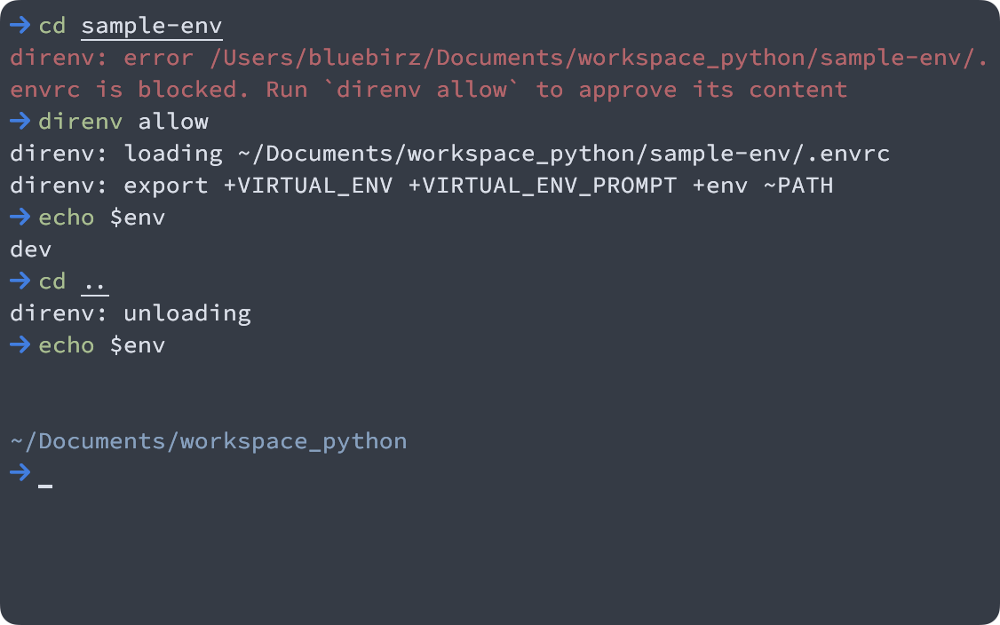
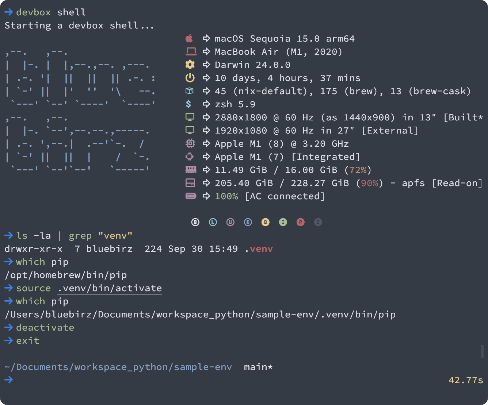
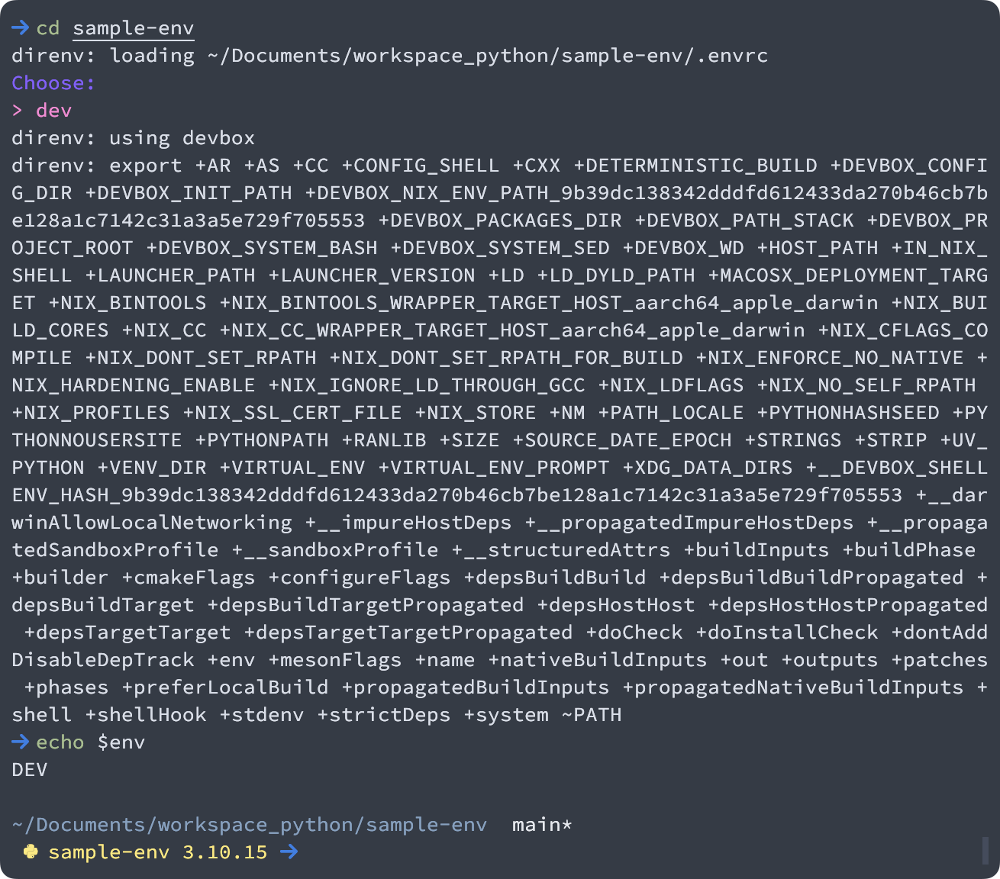

# sample-env

Demo direnv, devbox, and gum for isolated environments management

## about

- This repo is for demonstrating how to setup an isolated environment using `devbox`, `direnv` and `gum`.
- It is written aside blogs described below.

## blog related

- [EN] [isolated development with direnv & devbox (& gum)](https://www.bluebirz.net/en/isolate-dev-direnv-devbox-gum/)
- [TH] [isolated development ด้วย direnv & devbox (& gum)](https://www.bluebirz.net/th/isolate-dev-direnv-devbox-gum-th/)
- [Medium] [isolated development with direnv & devbox (& gum)]<https://medium.com/@bluebirz/isolated-development-with-direnv-devbox-gum-c021d5be7f60>)

## How to run

### [`direnv`](https://direnv.net)

- install `direnv` (e.g. via homebrew)
- add hook into shell file i.e. `.zshrc`

  ```sh
    eval "$(direnv hook zsh)"
    ```

- go into the target folder.
- create `.envrc` inside the target folder with a proper layout (see more <https://github.com/direnv/direnv/wiki>)
- run `direnv allow` if needed.



### [`devbox`](https://www.jetify.com/devbox)

- install `devbox` via <https://www.jetify.com/devbox/docs/installing_devbox/>
  - or via [Nix package manager](https://nixos.org/download/)
- go into the target folder.
- run `devbox init`
- search packages via `devbox search package[@version]`
- add a package via `devbox add package[@version]`
- start via `devbox shell`
- exit via `exit`
- generate direnv `.envrc` via `devbox generate direnv`



### [`gum`](https://github.com/charmbracelet/gum)

- install `gum` (e.g. via homebrew)
- various usage e.g. `gum choose "1" "2" "3"`
- integrate with `direnv` and `devbox` by updating `.envrc` as follows:

```
# before
eval "$(devbox generate direnv --print-envrc)"

# after
# maintain multiple env files inside `.envs` folder
eval "$(devbox generate direnv --print-envrc --env-file .envs/$(gum choose `ls .envs`))"
```


